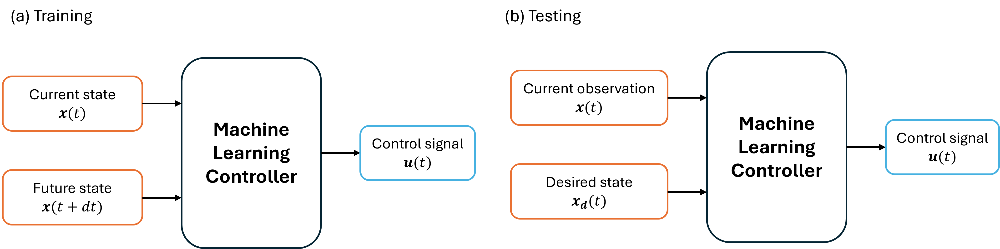
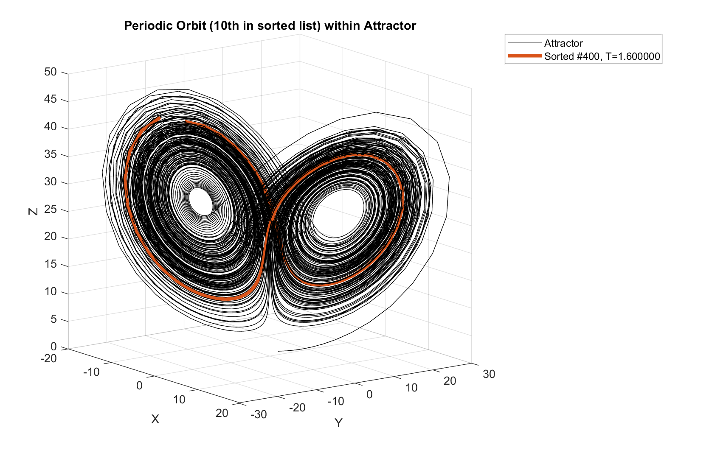
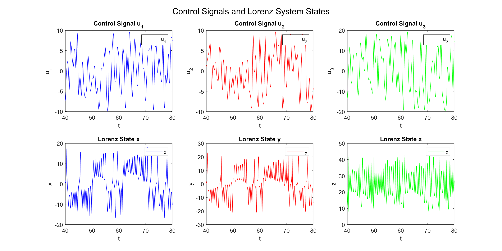
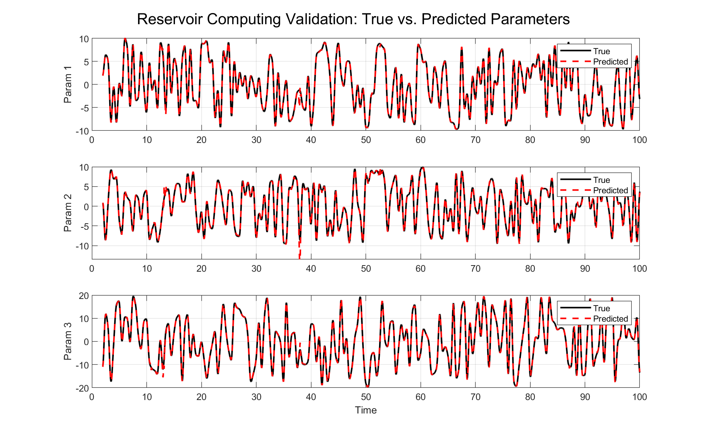
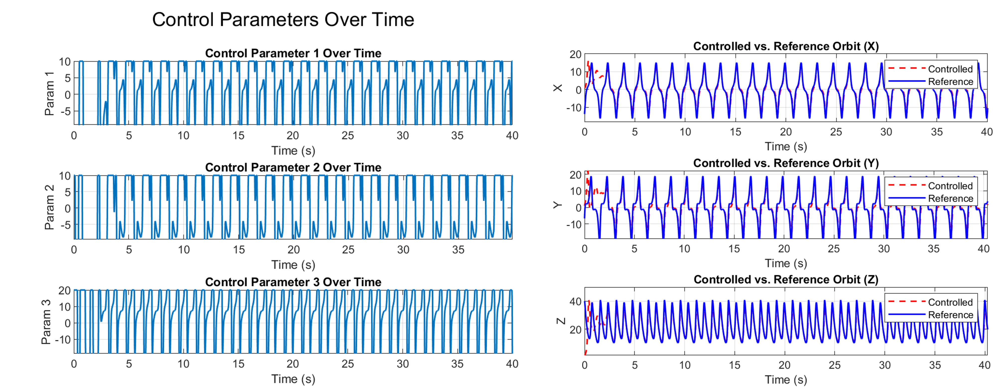
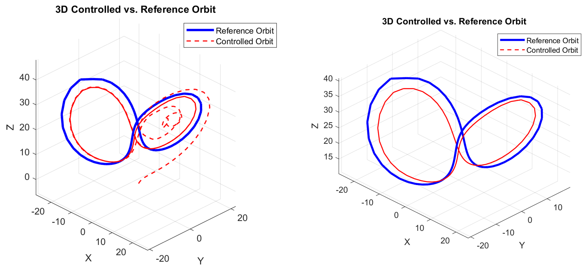

<h1 align="center">Dynamical Systems Control with Machine Learning</h1>

Previously we have published a paper in [Nature Communications](https://doi.org/10.1038/s41467-023-41379-3), which proposed a framework to control dynamical systems, specifically robotic manipulators, to track complex chaotic or periodic trajectories. The codes are available in [My Github](https://github.com/Zheng-Meng/Tracking-Control). However, that is a complicated issue, and it is not easy to train. At that time we trained at least hundreds of reservoirs using long training data.

Many friends asked me that they are interested in this field (model-free control of dynamical systems with machine learning), and wonder if there exists a comparably simpler task for beginners to start with. In light of this, here I want to introduce controlling chaotic systems, specifically a chaotic Lorenz system to a periodic orbit, by using reservoir computing (a type of recurrent neural network). This task has been done in this [Paper](https://iopscience.iop.org/article/10.1088/2632-072X/ac24f3) (though there are differences).

<h3>Overview</h3>

<p align="center">

</p>

This line of researh follows the above framework. Specifically, we first need to generate the training data, where the current state **x**(t) is driven by some control signal **u**(t) to the next state **x**(t+dt), step by step. You can imagine a robotic arm as an example: torques are added to the arms to push them move in time. After collecting this data, we would, as panel (a) depicts, put the current state and the next state together as the input, and the control signal that causes this as the output. Thus, the machine learns through the training phase: if we want to move from the current state to a nearby next state, how should we add the control signal to the system.

This is exactly how we test the model later. We give the current observed state **x**(t) and the target state **x**$_d(t)$ in each step as input, and the well-trained model should return an appropriate control signal. It is worth noting that this data-driven control framework is not only limited to chaotic orbit control or robotic arms; As long as it is a dynamical system, it should work.

<h3>Example: Controlling the Lorenz System</h3>

Now let’s move to our example. Our aim here is to control a chaotic Lorenz system to a periodic orbit. 

First, run `find_lorenz_orbits.m` to identify periodic orbits for control and save them to a file for later use. Since I have already run this step and saved the results, you may skip it if you want. Below, I plot one of the identified orbits:

<p align="center">

</p>

The black attractor is the Lorenz attractor, and the red line denotes one orbit that we will later control the system to follow. We choose the following method to add control signals to the Lorenz system:

$$\frac{dx}{dt}=\sigma (y-x) + u_1, $$

$$\frac{dy}{dt}=x(\rho - z) - y + u_2,$$

$$\frac{dz}{dt}=xy-\beta z + u_3,$$

where $$x, y, z$$ are the variables, and $$\sigma, \rho, \beta$$ are system parameters. The control signals **u**$$=(u_1, u_2, u_3)$$ are added to the equation to perturb the dynamics.

Following the framework introduced above, we first train a reservoir computing model to predict the control signals given the current and next states. Notably, the control signals are chosen within a specific range, generated by Gaussian noise and then smoothed. The control signals, as well as the time series affected by them, are shown below:

<p align="center">

</p>

Given this data, we can then train the machine learning controller. Here we use reservoir computing (RC) to serve as the controller.  As I already provided a detailed introduction about reservoir computing, if you are interested, you can take a look [here](https://github.com/Zheng-Meng/Reservoir-Computing-and-Hyperparameter-Optimization).

Run `train_rc_lorenz.m` to train the RC. After training, we evaluate the performance on the validation set, that is, we predict the control signal given current and next state, following the order on the attractor:

<p align="center">

</p>

The evaluation performance is great! But we should not celebrate too early, a great performance on evaluation does not directly mean the control will perform well on the target orbit, as that requires continuous control over time. Therefore, we need to further test the trained RC.

Run `test_rc_lorenz.m`, and it will use the saved trained RC and test on the pre-found orbit. One example result is shown below:

<p align="center">

</p>

On the left are the control signals generated by reservoir computing, where they are limited within the bounds set in training (even if the RC predicts values out of range). The controlled time series, compared with the ground-truth target, are shown on the right. It can be seen that the RC tracks the target periodic orbit well visually ^_^

If we plot this tracking result in 3D, the performance is as follows:

<p align="center">

</p>

On the left is the plot from the start, and on the right is after removing the unstable beginning part, showing the long-term stable control. The RC successfully tracks the periodic orbit, although there are small deviations that are not obvious in the previous plot. Finally we made it!

<h3>More information</h3>

You can do more tests, such as longer or shorter periodic orbits, or control it to some unstable steady states, and more, to futher validate the performance.

To improve the performance, one should optimize the hyperparameters of RC, as they are vital to the result, as shown [here](https://github.com/Zheng-Meng/Reservoir-Computing-and-Hyperparameter-Optimization).

It is also worth noting that one problem existing in many papers (and also shown here) is that the control signals often need to be sufficiently large to achieve good performance. However, in many real scenarios, our available energy is limited. Thus, how to use as little control energy as possible while still achieving satisfactory control is an interesting topic for future work.


<h3>Citation</h3>

```
@article{zhai2023model,
  title={Model-free tracking control of complex dynamical trajectories with machine learning},
  author={Zhai, Zheng-Meng and Moradi, Mohammadamin and Kong, Ling-Wei and Glaz, Bryan and Haile, Mulugeta and Lai, Ying-Cheng},
  journal={Nature communications},
  volume={14},
  number={1},
  pages={5698},
  year={2023},
  publisher={Nature Publishing Group UK London}
}
```

```
@article{canaday2021model,
  title={Model-free control of dynamical systems with deep reservoir computing},
  author={Canaday, Daniel and Pomerance, Andrew and Gauthier, Daniel J},
  journal={Journal of Physics: Complexity},
  volume={2},
  number={3},
  pages={035025},
  year={2021},
  publisher={IOP Publishing}
}
```


